## Hi, I'm Shama 💻

  

 
  <b>Technology Stack</b> 

 

<table> <tr>

<!-- LEFT COLUMN -->
<td valign="top" width="50%">

  <h4>Programming Languages</h4>

  

    
    
    
    
    
    
    
    
  

  <h4>Web & Application Development</h4>

  

    
    
    
    
    
    
  

  <h4>Databases</h4>

  

    
    
  

  <h4>Game & Interactive Development</h4>

  

    
  

</td>

<!-- RIGHT COLUMN -->
<td valign="top" width="50%">

  <h4>Development Tools</h4>

  

    
    
    
    
    
    
    
  

  <h4>Systems & Administration</h4>

  

    
    
    
    
  

  <h4>Cloud & Microsoft</h4>

  

    
  

  <h4>Design & Collaboration</h4>

  

    
    
  

</td>

</tr> </table>

 &nbsp;<b>GitHub Analytics</b>

 

  

  

  

 
  <b>Future Learning Goals</b> 

  
What I'm Working On
- Improving my software engineering skills
- Building projects with Java, C/C++ and C#
- Exploring Python and AI
- Developing web and desktop applications
- Learning more about algorithms and intelligent systems
- Building personal and university projects
  

